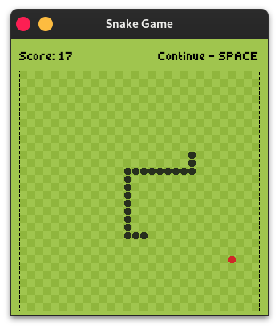
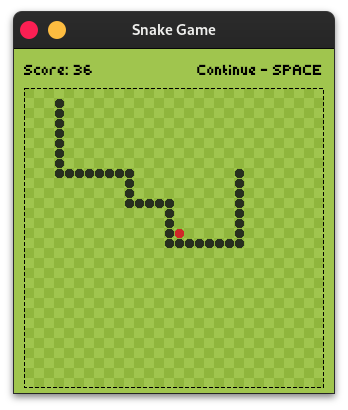
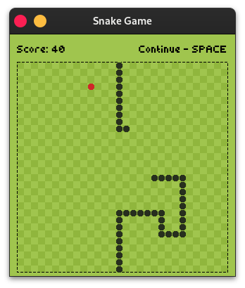
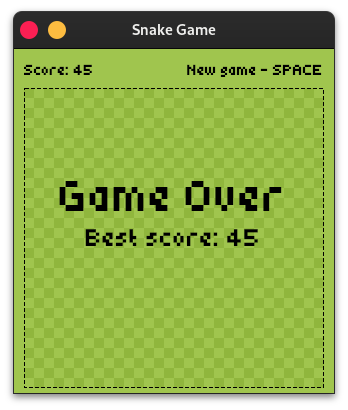

    

# :snake: Snake Game - Qt

Welcome to the Snake Game project! This is a classic Snake game implemented using the **Qt Framework**.

## Introduction

This project is a simple yet fun implementation of the Snake game using C++ and the Qt framework. The objective of the game is to control the snake to eat food, which makes it grow longer, while avoiding collisions with itself.

## :stars: ​Features 

* Classic Snake gameplay

* Score tracking

* Best score

* Increasing difficulty as snake grows

* Sound effects

## :building_construction: ​Build

|                           Windows                            |                            Linux                             |                            MacOS                             |
| :----------------------------------------------------------: | :----------------------------------------------------------: | :----------------------------------------------------------: |
|  |  |  |

## :gear: Assets

Game font: [XSSNAKE](https://github.com/blaise-io/xssnake) [**Author**: [blaise-io](https://github.com/blaise-io)]

## :deciduous_tree: ​Screenshots 

<details><summary>Click me 🐈</summary>









</details>

## 🚧 Requirements 

Qt installed (Qt 6.x.x or higher)

## 💡Installation 

### Windows

#### Installer

1. Chose `snake-game-installer-windows.exe` from Release page and install them to your computer

2. Open Installer
3. Follow the installer instructions
4. Done :white_check_mark:

#### :package: Portable

1. Chose `snake-game-portable-windows.zip` from Release page and install them to your computer

2. Unpack the package

3. Run `SnakeGame.exe`

4. Done :white_check_mark:

### Linux

#### Ubuntu Package

1. Chose `snake-game-ubuntu.deb` from Release page and install them to your computer

2. Go to downloads folder

3. Run the command in terminal:

   ```bash
   sudo dpkg -r snake-game-ubuntu.deb
	```
4. Done :white_check_mark:

#### Installer

1. Chose `snake-game-installer-linux.run` from Release page and install them to your computer;

2. Go to downloads folder

3. Run the command:

   ```bash
   chmod +x snake-game-installer-linux.run
   ```

4. Double click to installer **or** run the command:

   ```bash
   ./snake-game-nstaller-linux.run
   ```

5. Follow the installer instructions

6. Done :white_check_mark:

#### :package: Portable

1. Chose `snake-game-portable-linux.zip` from Release page and install them to your computer

2. Unpack the package

3. Run the command:

   ```bash
   cd snake-game-portable-linux
   chmod +x SnakeGame.sh
   ```

4. Run `SnakeGame.sh`:

   ```bash
   ./SnakeGame.sh
   ```

5. Done :white_check_mark:

### Clone repository from GitHub

#### :footprints: Steps ​

1. Clone the repository:

   ```bash
   git clone https://github.com/MOsinskyi/snake-game-qt.git
   cd snake-game-qt
	```

2. Open the project in Qt Creator:

   * Launch Qt Creator

   * Open the `SnakeGame.pro` file

3. Build and run the project:

   * Click on the build button in Qt Creator
   * Run the project

## Usage :hugs:

* Use arrow keys to control the direction of the snake.

* Eat the food to grow longer.

* Use **space** key to pause, continue and start new game

* Avoid collision with the snake`s own body.

* Try to achieve the highest score possible!

## :chart_with_upwards_trend: Contributing 

Contributions are welcome! If you have any suggestions, bug reports, or feature requests, please open an issue or submit a pull request.

1. Fork the repository

2. Create you feature branch:

   ```bash
   git checkout -b feature/YourFeature
	```

3. Commit your changes:

   ```bash
   git commit -m 'Add some feature'
	```

4. Push to the branch:

   ```bash
   git push origin feature/YourFeature
   ```

5. Open a pull request

## :copyright: License

This project is licensed under the MIT License. See the [LICENSE](LICENSE.txt) file for more details

## :phone: Contact

For any inquiries or feedback, please contact:

* **E-mail**: [maximosinskiy@gmail.com](mailto:maximosinskiy@gmail.com)
* [GitHub profile](https://github.com/MOsinskyi)
